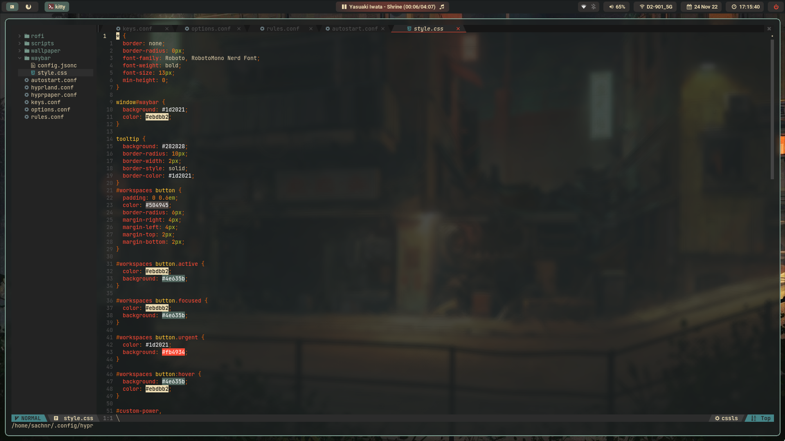

# hyprlandcfg



### **Required**
```
pacman -S slurp grim xdg-desktop-portal-wlr swayidle swaylock wl-clipboard playerctl mpd ncmpcpp pavucontrol
yay -S hyprpaper-git waybar-hyprland mpdris2 rofi-lbonn-wayland 
```

<details>
<summary><big><B>envvars for nvidia</big></summary>

`/usr/bin/hlnvidia`
```
#!/bin/sh

#cursor
export XCURSOR_SIZE=24

# nvidia
export WLR_NO_HARDWARE_CURSORS=1
export GBM_BACKEND=nvidia-drm
export __GLX_VENDOR_LIBRARY_NAME=nvidia
export LIBVA_DRIVER_NAME=nvidia
export __GL_VRR_ALLOWED=0
export WLR_DRM_NO_ATOMIC=1
export WLR_BACKEND=vulkan

# session
export XDG_CURRENT_DESKTOP=Hyprland
export XDG_SESSION_TYPE=wayland
export XDG_SESSION_DESKTOP=Hyprland

#qt
export QT_AUTO_SCREEN_SCALE_FACTOR=1
export QT_QPA_PLATFORM="wayland;xcb"
export QT_WAYLAND_DISABLE_WINDOWDECORATION=1
export QT_QPA_PLATFORMTHEME=qt5ct

# Toolkit Backend Variables
export _JAVA_AWT_WM_NONEREPARENTING=1
export SDL_VIDEODRIVER=wayland
export CLUTTER_BACKEND="wayland"
export GDK_BACKEND="wayland,x11"

# firefox
export MOZ_ENABLE_WAYLAND=1

exec Hyprland
```

`/usr/share/wayland-sessions/hyprlandnvidia.desktop`
```
[Desktop Entry]
Name=HyprlandNvidia
Comment=An intelligent dynamic tiling Wayland compositor
Exec=hlnvidia
Type=Application
```

</details>

### **fixes**
<details>
<summary><b>Gtk apps take long time to load</summary>

install xdg-desktop-portal from this [*repo*](https://github.com/flatpak/xdg-desktop-portal)
</details>
<details>
<summary><b>screen sharing with nvidia card does not work</summary>

~~try this [*patch*](https://aur.archlinux.org/cgit/aur.git/tree/nvidia.patch?h=hyprland-nvidia-git)~~
</details>
